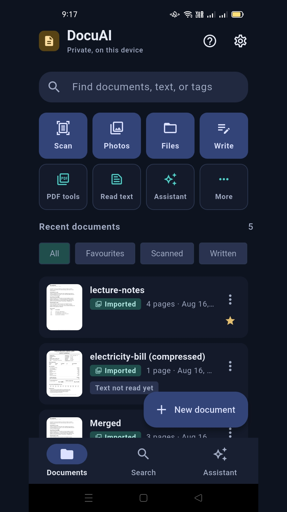
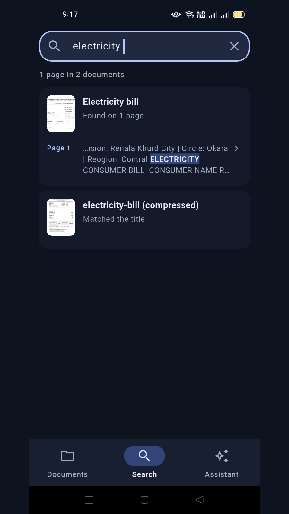
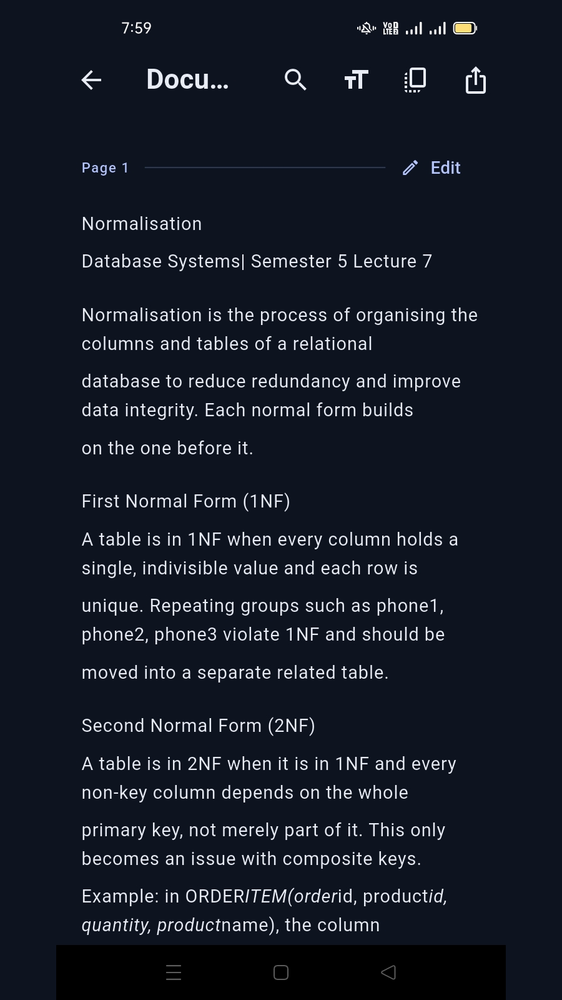

# DocuAI

**Intelligent document scanner and offline assistant for Android.**

Scan a document, have its text read on-device, search across everything you have
scanned, and ask questions that are answered by quoting your own pages back to
you. No account, no server, no sync.

<!-- TODO: swap for the public store link once production access is granted -->
[](#)

> **Play Store:** in **closed testing**, version 1.0.2. The store listing,
> content rating and Data safety declaration are complete and approved. The
> public link is pending production access — see
> [Release status](#release-status).

---

## Screenshots

| Library | Search | Reader |
|---|---|---|
|  |  |  |

---

## What DocuAI is

DocuAI turns paper into something you can search and question. The flow it is
built around:

1. **Capture** a document with the camera, or import one you already have.
2. **Read it.** Text recognition runs automatically the first time a document is
   opened, and the recognised text becomes part of the document.
3. **Find it.** Everything recognised is indexed, so a phrase from page four of a
   bill you scanned in March is one query away.
4. **Ask about it.** The assistant answers by finding the passage that best
   matches your question and quoting it, with a citation pointing at the page it
   came from.

It is an Android app. There is no iOS target, and none is planned.

---

## Offline by design

DocuAI has **no account system, no backend and no sync.** Scanning, text
recognition, search, summarising and question answering all execute on the
device. Documents are written to the app's private storage and are never
uploaded.

Two things follow from that, and both are deliberate:

- **Cloud backup is switched off explicitly.** `allowBackup` defaults to `true`,
  which would let Android Auto Backup copy the document database — metadata *and*
  the full recognised text of every scan — to the user's Google Drive. Both the
  cloud-backup and device-transfer paths are opted out of in the manifest.
- **There is no telemetry in DocuAI's own code.** No analytics SDK, no crash
  reporter, no HTTP client. Release builds do not even write errors to logcat,
  because an exception string in this app routinely carries a document title.

### One honest caveat

The release build declares `INTERNET` and `ACCESS_NETWORK_STATE`, so those
permissions appear on the Play listing. **Neither is requested by DocuAI.** They
arrive with `com.google.android.datatransport`, the usage-telemetry component
inside Google's ML Kit libraries, which are what perform scanning and text
recognition. DocuAI's own code makes no network requests of any kind.

They can be stripped with `tools:node="remove"`, but that has to be verified
against a real scan in a release build before it is claimed. Full detail in
[PRIVACY.md](PRIVACY.md).

---

## Features

Everything listed here is implemented in this repository.

### Capture and import

- **Document scanning** via ML Kit's document scanner — automatic edge
  detection, perspective correction and capture, up to 20 pages per scan.
- **Import from the gallery**, through the system photo picker (no storage
  permission required). Photos are straightened from their EXIF orientation,
  capped at 2400px on the long edge and re-encoded, so an imported photo behaves
  exactly like a scan.
- **Import files** — `.pdf`, `.docx`, `.txt`, `.md`, `.jpg`, `.png`, `.webp`. A
  PDF is rendered to page images through Android's own renderer at 150 dpi and
  read like a scan; Word and text files arrive as editable text.
- **Open with DocuAI** from another app — a file manager, a chat app or a browser
  download can hand over a PDF, image, text file or ZIP, either by "Open with" or
  through the share sheet.

### Reading and text

- **On-device OCR** (ML Kit Text Recognition, Latin script). The model is bundled
  into the app rather than downloaded, so recognition works on any device.
- **Layout-aware text rebuilding.** Rather than taking ML Kit's flat output —
  which returns a bill one word per line — DocuAI walks the block/line/element
  hierarchy and reassembles the page from the bounding boxes, so labels stay
  beside their values.
- **Per-page recognition status.** One unreadable page does not fail the
  document; the rest is kept, indexed, and the failed page can be retried.
- **Edit recognised text**, with a hand-corrected page never silently overwritten
  by a later recognition run.
- **A reader view** with adjustable text size, persisted between documents.

### Writing

- **Create documents in the app**, mixing typed pages and scanned pages in one
  document.
- **Lightweight formatting** — three heading levels, bold, italic, bullet and
  numbered lists, and quotes. Markers are drawn, never shown as syntax.
- **Pictures inside text**, with a built-in editor for rotating and cropping
  them. Files nothing refers to any more are swept up automatically.

### Organise

- **Page management** — add, delete, reorder and replace pages.
- **Tags and favourites**, both searchable.
- **Rename and delete**, with deletion removing the record, the page images and
  any exported file together.

### Search

- **Full-text search** across titles, tags and recognised page text.
- **Tiered ranking.** An exact title match beats a partial title match, which
  beats an exact phrase found in the text, which beats a term match ranked by
  **Okapi BM25**, which beats a tag-only match — so typing a document's name
  finds that document rather than a page that mentions the same words.
- **Highlighted snippets** showing where on which page the match was found, and
  opening straight to that page.

### Assistant

- **Ask questions about your documents** and get an answer drawn from them.
- **Citations on every answer** — document, page number, an expanded snippet, and
  which of your question's terms that passage actually contained.
- **Quick actions** — summarise a document (full or brief), explain a document or
  a selected passage, and extract every date, amount, name, place, reference
  number or contact detail on the page.
- **Suggested questions** generated from your own library, and only offered when
  the documents actually carry the kind of thing being offered.
- **Conversations**, kept per document or across the whole library, persisted
  locally.

### Share and convert

- **Export to PDF**, composed on a background isolate so the app does not freeze,
  and named after the document.
- **Export to Word** (`.docx`), built from the document's text.
- **Share extracted text** directly, without producing a file first.
- **Merge PDFs** and **compress a PDF** at a chosen quality level.
- **Create a ZIP** from selected documents and files, kept in the library so it
  can be reopened, shared again or deleted.
- **Browse a ZIP without unpacking it** — the archive's central directory is read
  lazily, so the listing costs a few kilobytes regardless of archive size, and
  entries are decompressed only when tapped. Zip Slip and zip-bomb defences are
  applied to every entry.

---

## Tech stack

| Concern | Choice |
|---|---|
| Framework | Flutter 3.41 · Dart SDK `^3.11.0` |
| UI | Material 3, seeded colour scheme, full light and dark themes |
| State | Riverpod 3 |
| Navigation | GoRouter 17 (`StatefulShellRoute.indexedStack`) |
| Storage | Hive CE (metadata) + app-sandbox files (images, PDFs, archives) |
| Models | Freezed entities, hand-mapped to Hive data models |
| Scanning | Google ML Kit Document Scanner (Play Services module) |
| OCR | Google ML Kit Text Recognition (bundled model — no download) |
| PDF out | `pdf` · rendered on a background isolate |
| PDF in | `printing`, over Android's own `PdfRenderer` |
| Word | `archive` + `xml` (a `.docx` is a ZIP of XML, read and written directly) |
| Sharing | `share_plus`; file picking via `flutter_file_dialog` |
| Backend | **None** — by design |

`flutter_file_dialog` rather than the more obvious `file_picker`: every
`file_picker` release below 12 pins `win32 ^5.9`, which cannot resolve alongside
`share_plus 13`, and the version pub settles on instead has no Gradle namespace
and fails the Android build outright. `flutter_file_dialog` has no third-party
dependencies at all.

---

## Architecture

Feature-first Clean Architecture with a strict inward dependency rule.

```
lib/
├── main.dart               entry point (one line)
├── bootstrap.dart          composition root: error handlers, Hive, DI, runApp
└── src/
    ├── app.dart            MaterialApp.router
    ├── core/               theme, router, storage, errors, shared widgets
    └── features/<feature>/
        ├── domain/         entities · repository interfaces · use cases
        ├── data/           Hive models · data sources · repository impls
        └── presentation/   Riverpod providers · screens · widgets
```

**The rule:** `presentation → domain ← data`.

The `domain` layer is pure Dart — no Flutter, no Hive, no ML Kit — which is what
makes use cases testable without an emulator and lets the storage engine change
without touching business logic.

Three consequences worth knowing before reading the code:

- **Entities are separate from models.** `Document` (domain, Freezed) and
  `DocumentModel` (data, `@HiveType`) are distinct classes with explicit mapping.
- **Nothing throws across the boundary.** Data sources throw
  `CacheException` / `MlKitException`; repositories catch them and return a
  sealed `Failure` inside a `Result<T>`, so the compiler forces callers to handle
  the error path.
- **Hive stores metadata only.** Images, PDFs and archives live on disk, and
  their paths are persisted **relative** to the app documents directory —
  Android does not guarantee the absolute sandbox path survives a reinstall.

---

## Getting started

**Requirements**

- Flutter **3.41** or newer on the stable channel (Dart `^3.11.0`)
- Android SDK, JDK 17
- An Android device or emulator running API 24+

```bash
git clone <this-repo>
cd docuai
flutter pub get
flutter run
```

### Code generation

Freezed entities, Hive adapters and the Hive registrar are generated. Run this
after changing an entity or a `@HiveType` model, or on a fresh clone if the
generated files look stale:

```bash
dart run build_runner build --delete-conflicting-outputs
```

### Launcher icons

Regenerate after changing anything in `assets/icons/`. The output under
`android/app/src/main/res` is committed, so a fresh clone builds the branded icon
without running this first:

```bash
dart run flutter_launcher_icons
```

> **Scanning needs a real device.** The ML Kit Document Scanner is a Google Play
> Services module downloaded on demand, so it does not work on emulator images
> without the Play Store, or on non-GMS devices. DocuAI detects this and hides
> the scanner rather than failing when it is tapped — importing still works.
> Text recognition is bundled and works everywhere, including the emulator.

---

## Tests

```bash
flutter analyze                  # static analysis
flutter test                     # 85 unit + widget test files, no emulator needed
flutter test integration_test/   # on-device only
```

Domain use cases are tested against hand-written fakes in `test/helpers/`; the
domain layer has no dependencies, and its tests do not add one. The one
integration test exercises the ZIP encoder against a real device's cache
directory, real isolates and a real fifty-megabyte archive — none of which a
host-side test can stand in for.

---

## Release status

DocuAI is in **closed testing** on Google Play, version 1.0.2. Complete and
approved: the store listing, the content rating questionnaire, the Data safety
declaration, and the
[hosted privacy policy](https://sidra-hayat.github.io/DocuAI/privacy.html).

**Production access is expected on 2 September**, after which the public store
link replaces the placeholder at the top of this file.

Outstanding:

- [ ] Accessibility pass — TalkBack, and the system font at maximum. Text
      scaling is clamped to 1.4× in `app.dart`; raising it needs a device to
      check what the clamp was protecting.
- [ ] Production access, 2 September

## Release build

```bash
flutter build appbundle --release
```

Already configured in this repository:

- Application ID `com.sidrahayat.docuai`, minSdk 24, targetSdk 36
- R8 and resource shrinking, with narrow ML Kit keep rules
- Auto Backup disabled — cloud backup **and** device transfer
- Adaptive launcher icon with a monochrome layer for Android 13+ themed icons
- Route logging and error logging gated out of release builds

**Signing credentials are not in the repository.** They are read from
`android/key.properties`, which is git-ignored, so it is absent on a fresh
clone. Without it the release build falls back to the **debug** keystore, which
Play will reject — the Gradle build prints a warning saying exactly that. Copy
[`android/key.properties.example`](android/key.properties.example) and point it
at your upload keystore.

See [Release status](#release-status) for what remains before production.

---

## Known limitations

Stated plainly, because most of these are trade-offs rather than bugs.

**Text recognition**

- **Latin script only.** The recogniser is configured for
  `TextRecognitionScript.latin`, and the code that rebuilds page layout assumes
  left-to-right reading order. Documents in other scripts will not be read
  correctly.
- Recognition quality is ML Kit's. A blurred or badly angled capture produces
  poor text, and the affected page is marked failed rather than guessed at.

**Backup and data safety**

- **There is no backup, by design.** Cloud backup and device transfer are both
  disabled, and there is no export-everything feature. If the device is lost or
  the app is uninstalled, the documents are gone. Individual documents can be
  shared out as PDF, Word or ZIP, and that is currently the only way to get data
  off the device.

**PDF**

- **Merged and compressed PDFs lose selectable text.** Both operations work by
  rendering pages to images and recomposing them, so the output is page images.
  A true object-level merge would need a PDF engine this app does not bundle;
  the trade is stated in the UI rather than hidden.
- **Exported PDFs are not searchable either.** Positioning an invisible text
  layer needs per-block bounding boxes, and the OCR layer returns plain text.
- Merging is capped at 200 pages and a single PDF import at 60 pages. Reaching
  the cap keeps what was rendered and says it was truncated.

**Import and export**

- Only `.docx` is readable — an older `.doc` has to be re-saved first.
- **Word export cannot include pictures.** A document containing one is refused
  with an explanation rather than exported without them; PDF keeps them.
- HEIC photos cannot be decoded. Android hands them over happily and the image
  library cannot read them, so such a file is skipped and named.

**Assistant**

- **It cannot paraphrase.** There is no language model. Answers are passages
  quoted verbatim from your documents, and an "explanation" of a document is
  closer to its table of contents plus the facts it carries than to a
  description in someone's own words. The upside is that it cannot invent
  anything.
- **Each question is answered independently.** Conversation history is not used
  as retrieval context, so follow-ups like "what about the other one?" will not
  resolve. Doing that needs coreference, which a lexical retriever cannot do —
  feeding it prior turns would silently corrupt the query and produce
  confidently wrong results.
- **Name detection is a heuristic**, not entity recognition: runs of capitalised
  words filtered against lists of table furniture, organisation suffixes and
  headings. It prefers missing a name to inventing one, which is why a names
  result is reported as a *partial* match while a currency figure is reported as
  strong.
- Answer confidence describes **how completely the passage covered your
  question**, never whether the document is correct. The UI says "match" rather
  than "confident" for that reason.

**Platform**

- Android only.
- Scanning requires Google Play Services. Non-GMS devices can still import,
  read, search and ask.
- System text scaling is clamped to 1.4× — above that, page thumbnails and text
  overlays break. Raising the clamp needs a device to check what it was
  protecting.
- The assistant transcript is capped at 200 messages per conversation; older
  turns are dropped.

---

## Privacy

The policy is published at
**<https://sidra-hayat.github.io/DocuAI/privacy.html>**, and its source is
[PRIVACY.md](PRIVACY.md) in this repository.

The short version: documents never leave the device, there is no account, DocuAI
collects nothing, and the one thing that is not absolutely true — the ML Kit
telemetry component — is named rather than glossed over.
